# DEVY: Where Developers Find Their Missing Semicolon

System Architecture

```mermaid
graph TB
    %% Styling
    classDef userMode fill:#f8f9fa,stroke:#000,stroke-width:2px,color:#000
    classDef feature fill:#ffffff,stroke:#000,stroke-width:2px,color:#000
    classDef common fill:#f8f9fa,stroke:#000,stroke-width:2px,color:#000
    classDef header fill:#f8f9fa,stroke:#000,stroke-width:3px,color:#000,font-weight:bold

    %% Header
    DEVY[DEVY]

    %% Main User Modes
    subgraph Modes[" "]
        direction LR
        Dating["👥 Dating Mode"]
        Friends["🤝 Friends Mode"]
        Networking["💼 Networking Mode"]
        Help["🔧 Code Help Mode"]
    end

    %% Connect DEVY to Modes
    DEVY --> Dating
    DEVY --> Friends
    DEVY --> Networking
    DEVY --> Help

    %% Mode-Specific Features with more space
    subgraph Dating_Features[" "]
        D1["Romantic Matching"]
        D2["Date Planning"]
        D3["Shared Coding"]
    end

    subgraph Friend_Features[" "]
        F1["Casual Meetups"]
        F2["Group Projects"]
        F3["Social Coding"]
    end

    subgraph Network_Features[" "]
        N1["Professional Links"]
        N2["Career Growth"]
        N3["Tech Events"]
    end

    subgraph Help_Features[" "]
        H1["Screen Sharing"]
        H2["Code Reviews"]
        H3["Mentoring"]
    end

    %% Shared Features
    subgraph Common[Common Features]
        direction LR
        C1["GitHub Integration"]
        C2["Smart Matching"]
        C3["Secure Chat"]
        C4["Profile System"]
    end

    %% Connections with more spacing
    Dating --> D1 & D2 & D3
    Friends --> F1 & F2 & F3
    Networking --> N1 & N2 & N3
    Help --> H1 & H2 & H3

    %% Connect to common features
    D3 & F3 & N3 & H3 --> Common

    %% Apply styles
    class DEVY header
    class Dating,Friends,Networking,Help userMode
    class D1,D2,D3,F1,F2,F3,N1,N2,N3,H1,H2,H3 feature
    class C1,C2,C3,C4 common

    %% Light grey connections
    linkStyle default stroke:#D3D3D3,stroke-width:1.5px
```

# DEVY: Mode-Based Features

## User Modes

### 👥 Dating Mode

- Find romantic connections through code
- Tech-based date planning
- Shared programming sessions

### 🤝 Friends Mode

- Build coding friendships
- Form project groups
- Join social coding events

### 💼 Networking Mode

- Professional connections
- Career opportunities
- Industry networking

### 🔧 Code Help Mode

- Live collaboration
- Technical mentoring
- Problem-solving sessions

## Core Features

### Profile Integration

- GitHub authentication
- Repository showcase
- Activity metrics
- Tech stack display

### Smart Matching

- Language compatibility
- Experience level alignment
- Project interest matching
- Location preferences

### Safety & Privacy

- Mode-specific visibility
- Verified profiles
- Clear intentions
- Secure messaging

### Communication

- Code snippet sharing
- Screen sharing
- Video calls
- Project collaboration tools
